# mmdlog

Append-only, event-sourced syntax that compiles to Mermaid and renders as `.mmd` / `.svg` / `.png` / animated `.gif`.

Write a diagram one event at a time. Each prefix of the event stream is reduced to a state, compiled to canonical Mermaid, and stitched into a GIF in declaration order. The same pure core runs in Node and in the browser.

```
@diagram graph TD
+A[API]
+B[DB]
+A --> B

-B

+C[Redis]
+A --> C
```
→ `render` produces clean Mermaid (or SVG / PNG) · `gif` animates the prefixes frame by frame.

## Why

- **Append-only.** Each line is an event. Editing means appending more events, not rewriting earlier ones — perfect for AI agents, git history, and time-traveling demos.
- **Mermaid-native syntax.** After the `+` / `-` marker, the line is plain Mermaid. No new DSL to learn beyond the markers themselves.
- **Deterministic.** Same events → same Mermaid output, every time. The renderer is hermetic: no `ffmpeg`, no `puppeteer`, no `mmdc`.

## Install

```bash
npm install
npm run build
```

The only native binary is `@resvg/resvg-js` (prebuilt by npm install). No system-wide tools required.

## Quick start

```bash
# Render final state (Mermaid by default; --format svg|png to rasterize)
node dist/cli.js render examples/basic.mmdlog

# Animate the prefixes
node dist/cli.js gif examples/basic.mmdlog -o changes.gif

# Browser demo (canvas + Mermaid + gifenc, no Node needed)
npm run web   # http://localhost:5173/examples/web/

# Run the test suite
npm test
```

## DSL

One event per line. Two extensions: file uses `.mmdlog` (or short `.mmdl`).

| Prefix | Meaning |
|---|---|
| `@diagram <kind>` | Set the diagram kind (required once, before any event) |
| `+<mermaid line>` | Add — line after `+` is plain Mermaid |
| `-<id>` or `-<mermaid line>` | Remove (see [Removal](#removal) for per-diagram syntax) |
| `!` (line start) | Apply to state but do **not** emit a frame |
| `#` | End-of-line comment |

Supported diagrams: `graph`, `sequence`, `class`, `state`, `er`, `journey`, `gantt`, `pie`, `gitGraph`.

The only places mmdlog wraps Mermaid (instead of using a raw line) are the **block-style declarations** that don't fit on a single line: class members (`+member ClassId sig`) and ER attributes (`+attr Entity type name [flags]`). Every other line is Mermaid verbatim.

Unrecognized lines after `+` fall through as **raw passthrough** — they're emitted as-is, so things like `+Note over A,B: text`, `+autonumber`, `+commit tag: "v1.0"`, `+excludes weekends`, `+note for X "..."` work without explicit parser support.

### graph
```
@diagram graph TD
+A[API]
+B[DB]
+A --> B

-B

+C[Redis]
+A --> C
```

<details><summary>output mermaid</summary>

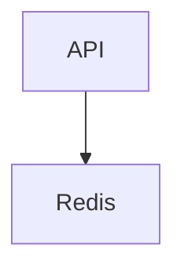

</details>

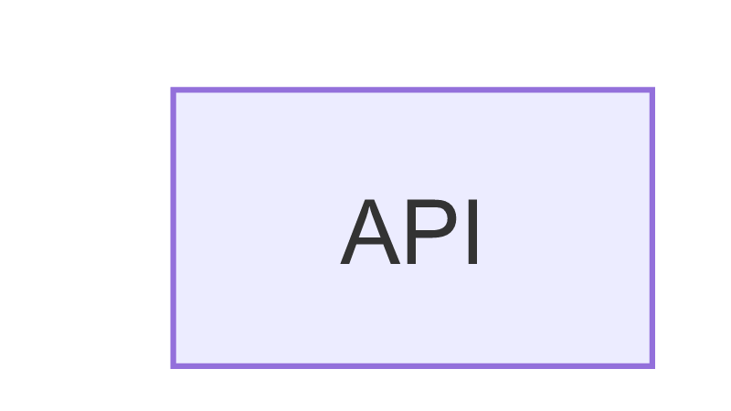

### sequence
```
@diagram sequence
!+participant Client as Web Client
!+participant API as API Server
!+participant DB as Main Database
+autonumber
+Client->>API: GET /users
+Note over API,DB: cache miss
+API->>DB: SELECT users
+DB->>API: rows
+API->>Client: 200 OK
-DB
```

<details><summary>output mermaid</summary>

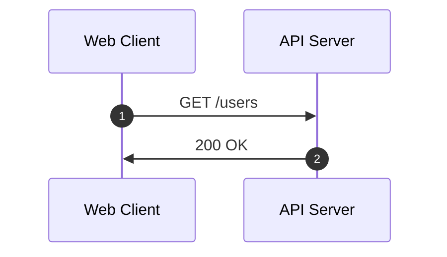

</details>

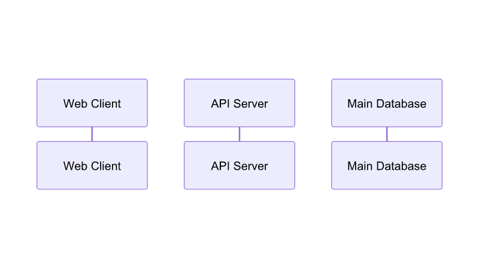

### class

#### DSL addition (block decomposition)
- `+member <ClassId> <signature>` — appends one member to the class (mermaid's block-style `class X { ... }` flattened to events). `<signature>` is mermaid's member syntax verbatim.

Other lines (`+class X`, relations like `+A --|> B`, `+note for X "…"`) are plain mermaid.

```
@diagram class

+class User
!+member User -string id
+member User -string email
+member User -int age
+member User +login(password) bool
!+member User +logout() void

+class Order
!+member Order -string id
+member Order -string userId
+member Order -float total
+member Order +addItem(name, price) void
+member Order +submit() bool

+User "1" --o "*" Order : places

+class PaymentGateway
+member PaymentGateway +charge(amount) bool
!+member PaymentGateway +refund(txId) bool

+class StripeGateway
!+member StripeGateway -string apiKey
+member StripeGateway +charge(amount) bool
!+member StripeGateway +refund(txId) bool

+StripeGateway --|> PaymentGateway : implements
+Order ..> PaymentGateway : uses

+note for StripeGateway "external API"

-PaymentGateway
```

<details><summary>output mermaid</summary>

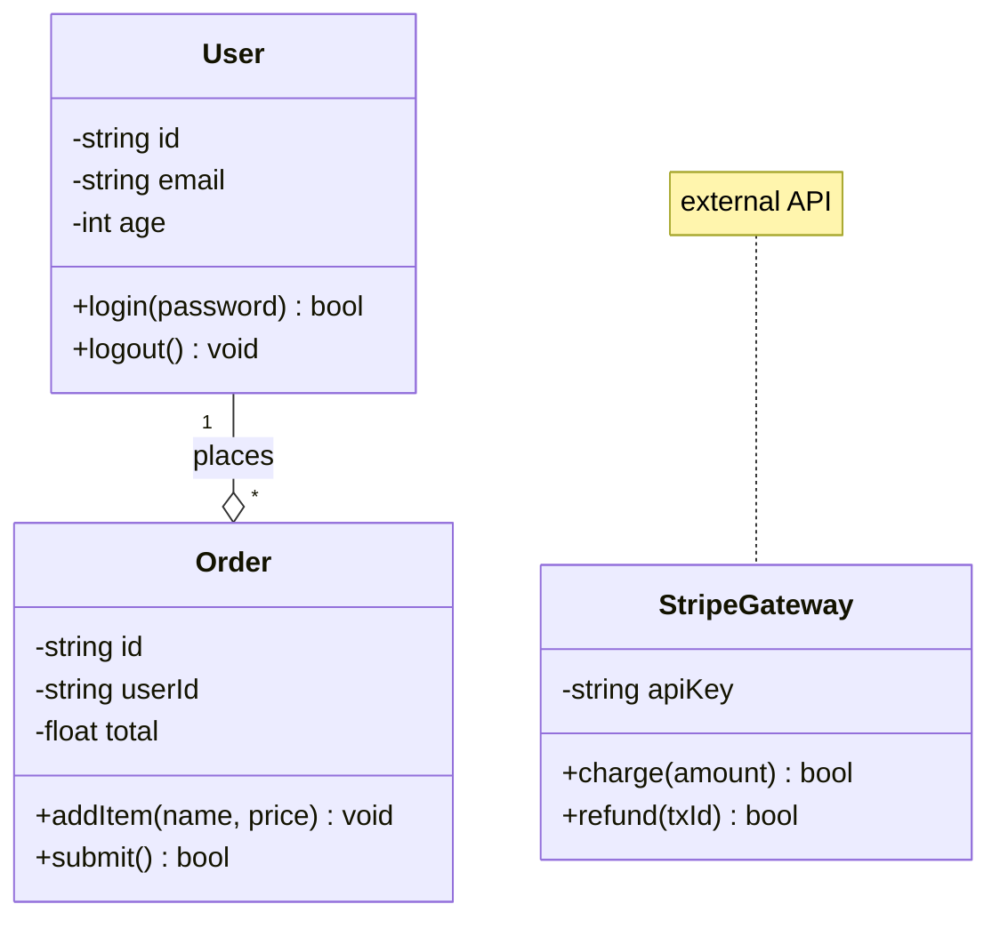

</details>

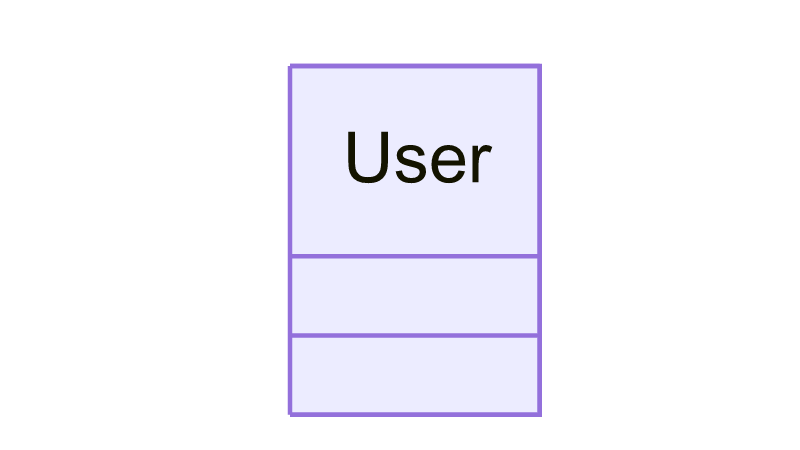

### state
```
@diagram state
!+state Idle
!+state Loading
!+state Success
!+state Error
+[*] --> Idle
+Idle --> Loading : fetch
+Loading --> Success : ok
+Loading --> Error : fail
+note right of Loading : may take a while
-Error
```

<details><summary>output mermaid</summary>

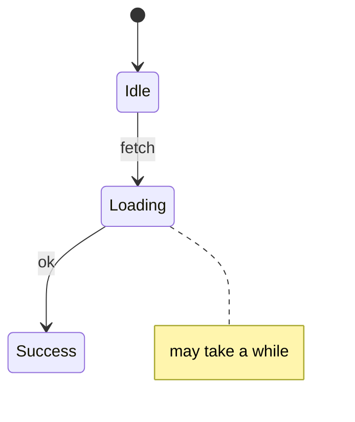

</details>

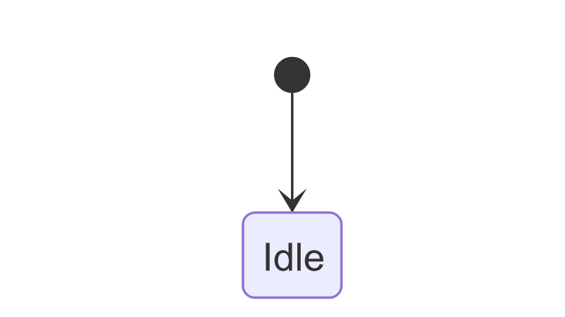

### er
#### DSL additions (block decomposition)
- `+entity <Name>` — declares an entity standalone
- `+attr <Entity> <type> <name> [flags]` — appends one attribute (mermaid's block-style `ENTITY { … }` flattened to events)

Relations (`+USER ||--o{ ORDER : places`) are plain mermaid.

```
@diagram er
!+entity USER
!+entity ORDER
+attr USER int id PK
+attr USER string email UK
+attr ORDER int id PK
+attr ORDER int user_id FK
+USER ||--o{ ORDER : places
```

<details><summary>output mermaid</summary>

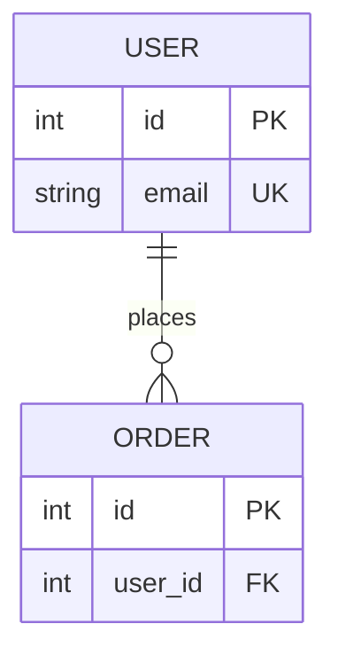

</details>

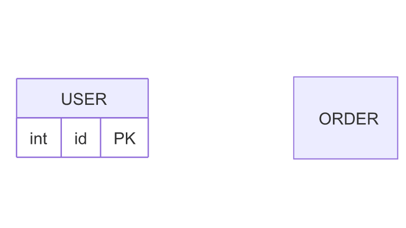

### journey
```
@diagram journey
!+title Merlog Adoption
!+section Discover
+Search docs : 4 : User
+Read examples : 3 : User
!+section Adopt
+Integrate SDK : 5 : User, Team
```

<details><summary>output mermaid</summary>

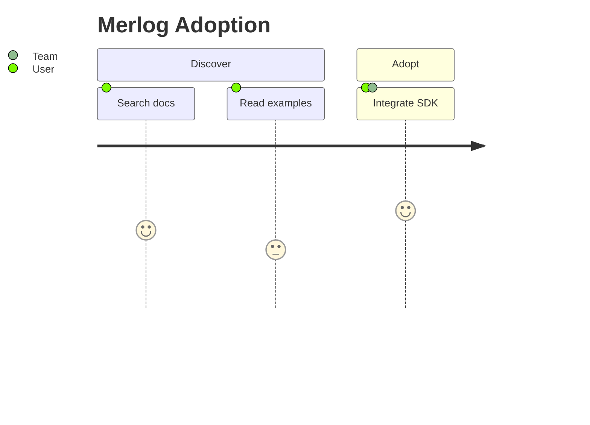

</details>

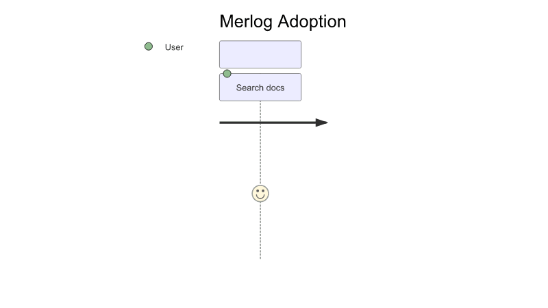

The most recent `+section` sets the active section for subsequent tasks (mermaid's implicit section context).

### gantt
```
@diagram gantt
!+title Merlog Milestones
!+dateFormat YYYY-MM-DD
!+axisFormat %m/%d
!+excludes weekends
+section Core
+Parser : done, p1, 2026-05-01, 7d
+Reducer : active, p2, after p1, 6d
+section Replay
+Frames : p3, 2026-05-15, 5d
```

<details><summary>output mermaid</summary>

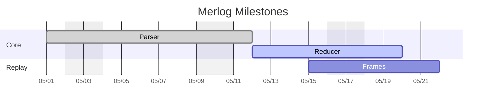

</details>

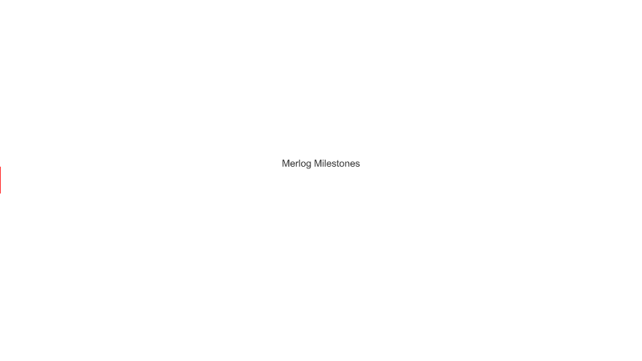

### pie
```
@diagram pie
!+title Deployment Share
+"API" : 45
+"Worker" : 30
+"DB" : 25
```

<details><summary>output mermaid</summary>

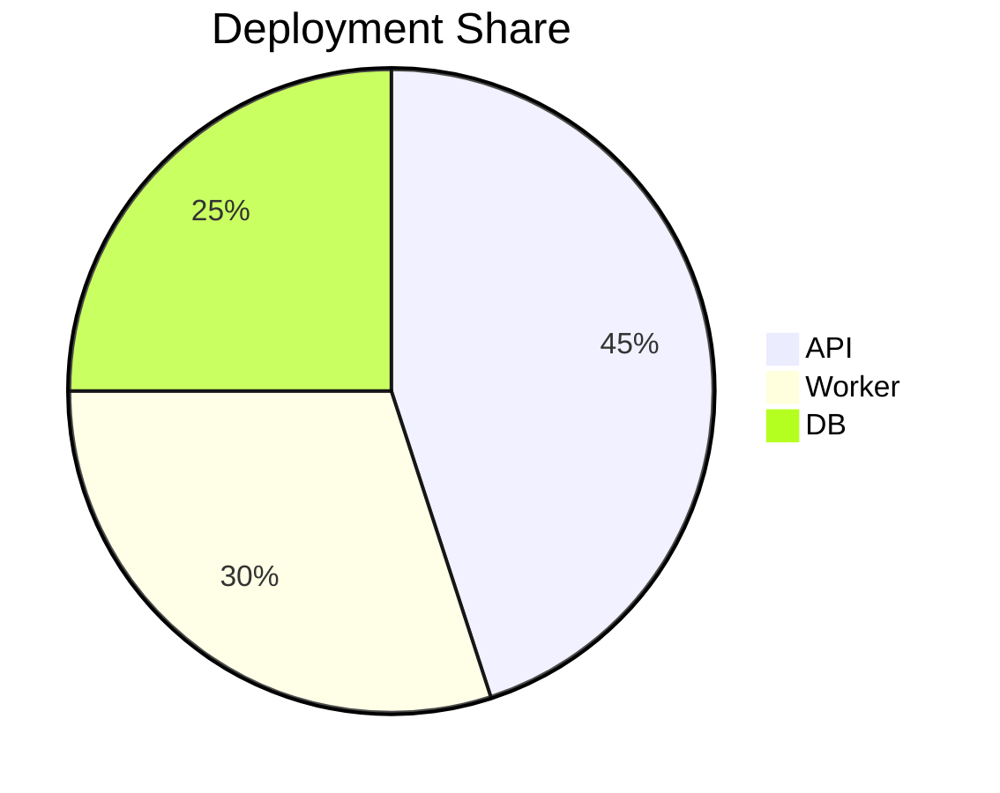

</details>

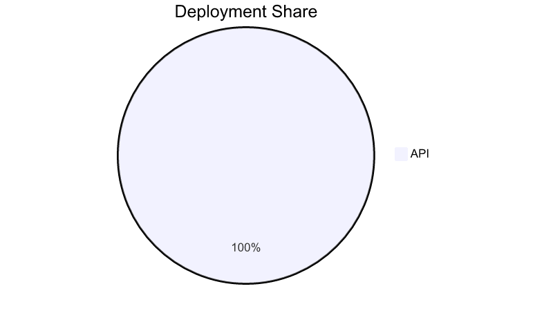

### gitGraph
```
@diagram gitGraph
+commit id: "c1"
+commit id: "c2" tag: "v1.0"
+branch feature
+checkout feature
+commit id: "f1"
+commit id: "f2" type: HIGHLIGHT
+checkout main
+merge feature
+commit id: "c3" tag: "v1.1"
```

<details><summary>output mermaid</summary>

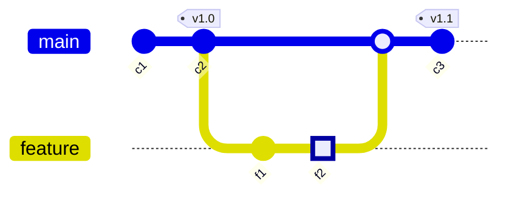

</details>

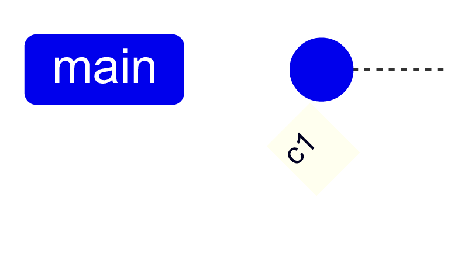

### Silent events (`!` prefix)

Apply to state but skip frame generation. Useful for seeding initial state, paired members, or boilerplate that shouldn't earn its own frame in the animation.

```
@diagram graph TD
!+A[API]
!+B[DB]
+A --> B
+C[Redis]
+A --> C
!-B
+A --> C
```

The first three lines are applied silently — they seed A, B, and the edge before any frame is rendered. The first visible frame already shows `A --> B`. Later `!-B` removes B (and the cascading edge) without producing its own frame.

`@diagram` is always silent automatically (it's a directive, not content).

<details><summary>output mermaid</summary>


</details>

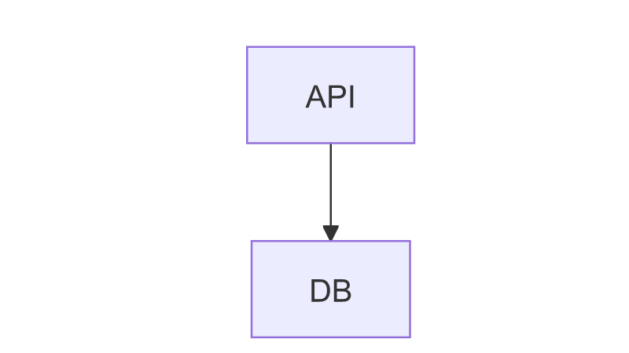

### Raw passthrough

Lines that don't match a structured pattern are emitted as-is. This means any single-line Mermaid syntax we don't explicitly model still works (notes, `autonumber`, `excludes`, `commit tag:`, etc.). See `examples/raw.mmdlog`:

<details><summary>output mermaid</summary>

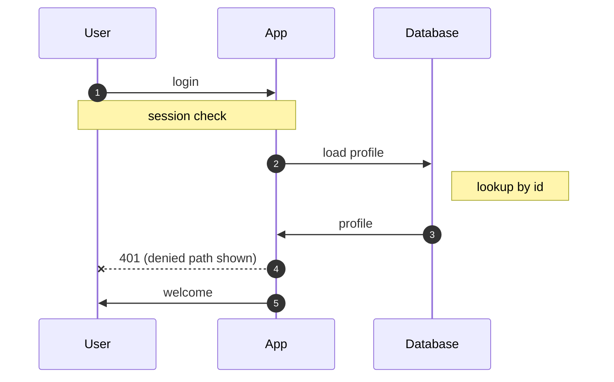
</details>

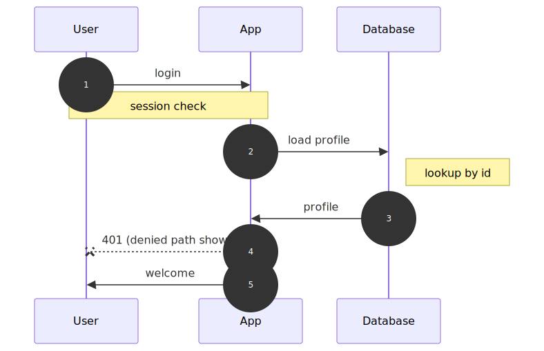

### Complex evolution

`examples/complex-topology.mmdlog` builds a full system through renames, removals, replacements, and rollbacks:

<details><summary>output mermaid</summary>

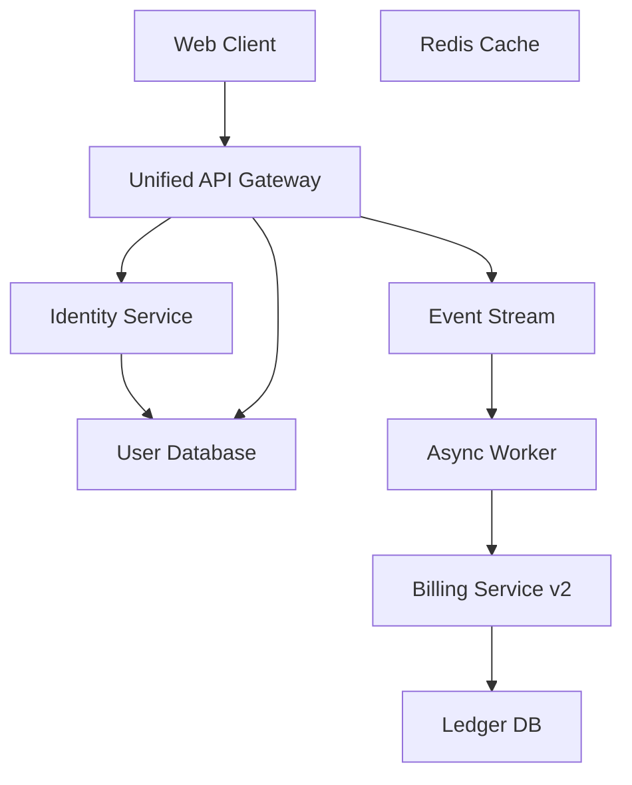

</details>

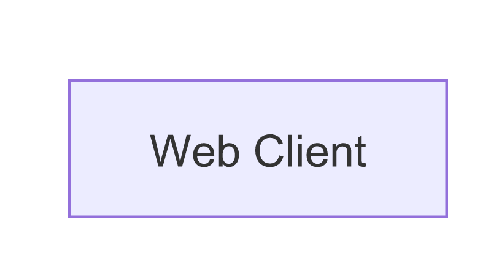

## Removal

`-` removes the named entity from the state. Structured references (edges, messages, relations, transitions, members, tasks under a section) cascade out automatically; raw lines that word-mention the id are also dropped.

| Diagram | Syntax | What it removes |
|---|---|---|
| graph | `-A` / `-A --> B` | node (cascades edges and raw refs) / specific edge |
| sequence | `-A` | participant (cascades messages and `Note over …` raw refs) |
| class | `-A` | class (cascades members, relations, raw refs) |
| state | `-A` | state (cascades transitions, raw refs) |
| er | `-A` | entity (cascades relations, raw refs) |
| journey | `-section X` / `-<task name>` | section (+ its tasks) / single task |
| gantt | `-title` / `-dateFormat` / `-axisFormat` / `-section X` / `-<task name>` | title or directive / section (+ its tasks) / single task |
| pie | `-title` / `-"label"` | title / slice |
| gitGraph | — | not supported (commit ledger is structurally append-only) |

## CLI

```
mmdlog render <input.mmdlog> [-o out] [--format mmd|svg|png] [--width N] [--height N]
mmdlog check <input.mmdlog>
mmdlog print-state <input.mmdlog>
mmdlog replay <input.mmdlog> [--json]
mmdlog frames <input.mmdlog> [-o dir/] [--format mmd|svg|png] [--width N] [--height N] [--no-collapse]
mmdlog gif <input.mmdlog> [-o out.gif] [--fps N] [--width N] [--height N] [--no-collapse] [--hold-ms N]
```

`render` emits the **final** state only. `--format svg|png` rasterizes once and requires `-o`; `--format mmd` (default) writes text to `-o` or stdout.

| Flag | Applies to | Default |
|---|---|---|
| `-o <path>` | render / frames / gif | stdout (render mmd), `frames/` (frames), `changes.gif` (gif) |
| `--format mmd\|svg\|png` | render / frames | `mmd` (render), `svg` (frames) |
| `--width N` | render / frames / gif | 1280 |
| `--height N` | render / frames / gif | 720 |
| `--fps N` | gif | 2 |
| `--no-collapse` | frames / gif | off — consecutive identical frames are collapsed by default |
| `--hold-ms N` | gif | 0 — extends the last frame's display time |
| `--json` | replay | off |

`npm link` exposes a `mmdlog` binary: `mmdlog gif input.mmdlog -o out.gif`.

## Browser

Static demo:
```bash
npm run web
```
Open `http://localhost:5173/examples/web/`. Pick an example, hit **Generate GIF**. A `<canvas>` plays the animation in sync with a syntax-highlighted Mermaid panel; the GIF blob is also downloadable.

Embed as a library:
```js
import mermaid from "mermaid";
import { parseMerlog, replayTimeline } from "mmdlog/dist/core/index.js";
import { encodeMermaidFramesToGif } from "mmdlog/dist/replay/browser.js";

mermaid.initialize({ startOnLoad: false, htmlLabels: false });

const { events } = parseMerlog(source, { strict: false });
const frames = replayTimeline(events);

const bytes = await encodeMermaidFramesToGif(
  frames.map((f) => f.mermaid),
  async (code, i) => (await mermaid.render(`id-${i}`, code)).svg,
  { width: 800, height: 450, defaultDelayMs: 500 }
);

const url = URL.createObjectURL(new Blob([bytes], { type: "image/gif" }));
```

`src/replay/browser.ts` exports:
- `encodeGif(frames, options)` — `{rgba, width, height, delayMs}[]` → `Uint8Array`
- `svgStringToRgba(svg, w, h)` — SVG string → RGBA via `<canvas>` (with `canvg` fallback for tainted canvases)
- `encodeMermaidFramesToGif(codes, renderFn, options)` — convenience wrapper

## How it works

1. **Parser** — splits lines into events; matches Mermaid-style patterns per diagram, falls through to raw passthrough for unrecognized lines (`src/core/parser.ts`).
2. **Reducer** — accumulates events into per-prefix state (`src/core/reducer.ts`). `-X` cascades: structured references (edges/messages/relations/transitions) connected to X are removed, and raw lines (notes, etc.) that mention X are filtered out by word-boundary match.
3. **Emitter** — serializes state to Mermaid in **declaration order** so the layout you write is the layout you see (`src/core/emitter.ts`).
4. **Replay** — generates per-prefix frames; silent events drop out (`src/core/replay.ts`).
5. **Render** — two paths from the same core:
   - **Node:** jsdom + Mermaid API → SVG → `@resvg/resvg-js` (in a child process for crash isolation) → `gifenc`.
   - **Browser:** native DOM/canvas to rasterize SVG → RGBA (with `canvg` fallback on tainted canvases) → `gifenc`.

## Layout

```
src/
  core/                  pure parser / reducer / emitter / replay (browser-safe, no I/O)
    parser.ts
    reducer.ts
    emitter.ts
    replay.ts
    types.ts
  replay/                Node renderer + GIF encoder + browser helper
    renderer.ts          Node CLI entry
    mermaidNode.ts       jsdom + Mermaid + getBBox / layout polyfill
    rasterize.ts         SVG → RGBA / PNG (child-process isolated)
    rasterize-worker.ts  resvg-js worker
    encodeGif.ts         gifenc wrapper
    browser.ts           canvas + gifenc helpers
  cli.ts                 CLI entry point
  index.ts               library entry point
examples/
  *.mmdlog               one example per diagram kind
  silent.mmdlog          silent-prefix demo
  raw.mmdlog             raw-passthrough demo
  complex-topology.mmdlog  evolving system with rename / removal / resurrection
  web/                   browser demo page (Prism highlight, canvas playback)
scripts/
  serve-web.mjs          static server for the browser demo
  validate-mermaid.mjs   round-trips examples through @mermaid-js/mermaid-cli
test/
  parser.test.js
  reducer.test.js
  emitter.test.js
  replay.test.js
  collapse.test.js
  gif.smoke.test.js
```

## Testing

```bash
npm test           # build + node --test (sequential, mermaid jsdom is shared global)
```

Covers parser corners (silent prefix, raw passthrough, error cases), reducer rules (cascade, dedup, recreate), emitter determinism, replay/silent semantics, frame collapse, and a GIF smoke test.

## Limitations

- Targets Mermaid 11 — major-version upgrades may need parser tweaks.
- Node CLI uses jsdom + polyfills; layout will not be pixel-identical to a real browser.
- `@resvg/resvg-js` can panic on some SVG path commands; the worker is isolated, so a panic loses one frame (replaced with the previous frame) rather than killing the renderer.
- Multi-line Mermaid blocks (`loop … end`, `alt … else … end`, `rect … end`, `state X { … }`) are not block-aware — intermediate prefixes will reject in Mermaid. Use complete blocks at a single position, or rely on raw passthrough for single-line directives.
- The browser path uses native canvas + font metrics and renders everything cleanly.
